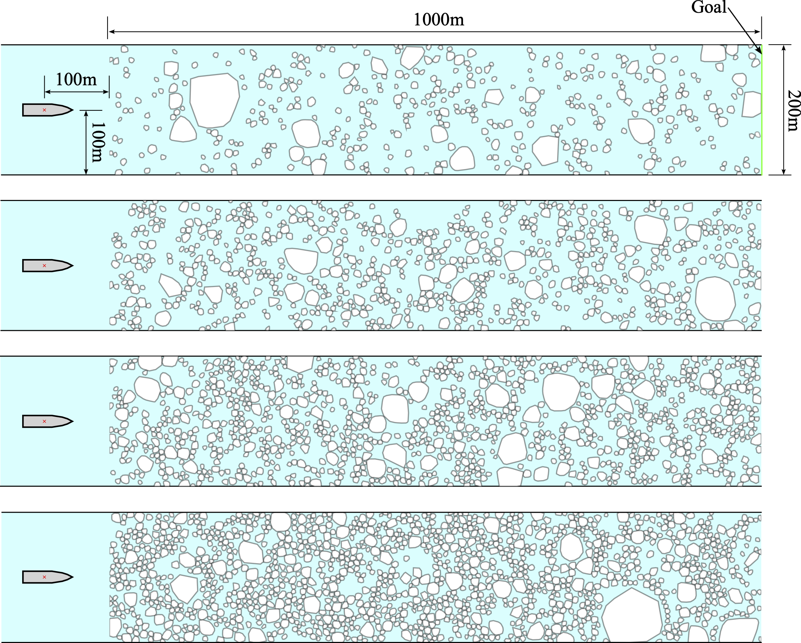
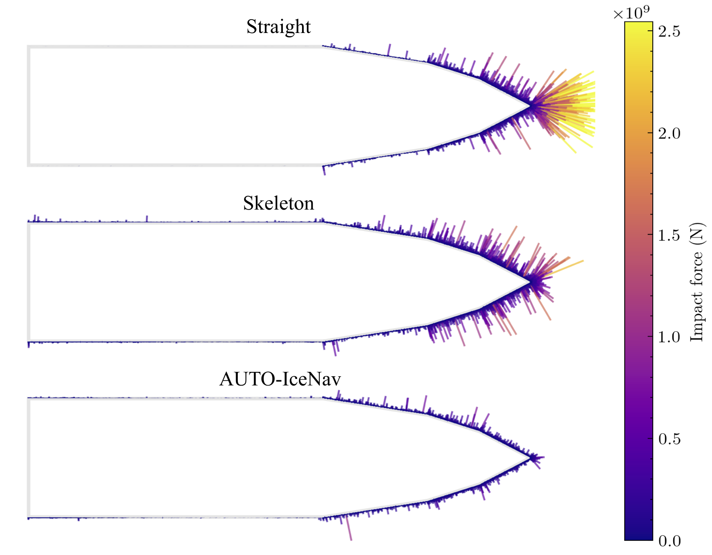

# AUTO-IceNav: A Local Navigation Strategy for Autonomous Surface Ships in Broken Ice Fields

https://github.com/user-attachments/assets/dccdf3ca-38fa-4af4-8843-a98052ce4ea9

This repo contains code for the following papers.
<table>
  <tr>
    <td><a href=""></a></td>
    <td><a href=""><i>AUTO-IceNav: A Local Navigation Strategy for Autonomous Surface Ships in Broken Ice Fields</i></a><br/> Rodrigue de Schaetzen, Alexander Botros, Ninghan Zhong, Kevin Murrant, Robert Gash, Stephen L. Smith <br/>In submission, 2024 <br/><br/> :point_left: Extended journal paper</td>
  </tr>
  <tr>
    <td><a href="https://arxiv.org/abs/2302.11601"></a></td>
    <td><a href="https://arxiv.org/abs/2302.11601"><i>Real-Time Navigation for Autonomous Surface Vehicles In Ice-Covered Waters</i></a><br/> Rodrigue de Schaetzen, Alexander Botros, Robert Gash, Kevin Murrant, Stephen L. Smith <br/>ICRA 2023 <br/><br/> :point_left: Original conference paper</td>
  </tr>
</table>

## Table of Contents
1. [Demo Videos from NRC Experiments](#demo-videos-from-nrc-experiments)
2. [Installation](#installation)
3. [Simulator](#simulator)
4. [Demo Scripts](#demo-scripts)
5. [Reproducing Simulation Experiments](#reproducing-simulation-experiments)
6. [Evaluation](#evaluation)
7. [Contact](#contact)
8. [Citation](#citation)
9. [Acknowledgement](#acknowledgement)

## Demo Videos from NRC Experiments
More videos can be found at this [google drive link](https://drive.google.com/drive/folders/1ftP-Dj6BW0-gLnjeTEmxeaJqgpjgWsX3?usp=sharing)
or can be uploaded upon request.

https://github.com/user-attachments/assets/18e8206e-d8ea-494c-a233-2bc695e09942

https://github.com/user-attachments/assets/f3c3e7b8-50b5-4ac4-9a2d-04bc79be034b

https://github.com/user-attachments/assets/a0ed863b-109d-4882-aa7c-c111840424c2

https://github.com/user-attachments/assets/92d486d2-05c1-498d-a91c-855232e878de

## Installation

```shell
# clone the repo and navigate to the directory
git clone https://github.com/rdesc/AUTO-IceNav/ && cd AUTO-IceNav

# create a new python 3.9 environment using conda (or some other virtual environment)
conda create --name py39 python=3.9

# activate the new environment
conda activate py39

# install packages 
pip install -r requirements.txt

# download the simulated ice field dataset
# this contains the 400 ice fields used in the simulation experiments
gdown https://drive.google.com/uc?id=1DuuVJfHHxXJqVZ1KG60q_X2uK5ZoS2cS --output data/

# (optional) run tests
cd tests && pytest .
```

## Simulator

This repo includes a 2D physics simulator for simulating ship-ice interactions.
It uses the [Pymunk](http://www.pymunk.org/en/latest/) library for simulating ice floes treated as rigid bodies, 
and the [Marine Systems Simulator (Python)](https://github.com/cybergalactic/MSS) for the ship dynamics.
The core physics parameters and utility functions are defined in [sim_utils.py](ship_ice_planner/utils/sim_utils.py),
while the main simulation loop is defined in [sim2d.py](ship_ice_planner/sim2d.py).

### Vessel Models

The vessel model is selected by setting the `sim_dynamics.vessel_model` parameter in the configuration object / file.
Additional vessel models can be added by extending the [SimShipDynamics](ship_ice_planner/controller/sim_dynamics.py) class.
There are currently two vessel models available:
- [Full scale PSV](ship_ice_planner/controller/supply.py)
  - Dynamics: 3 DoF linear state-space model
  - Mass: 6000,000 kg
  - Dimensions: 76.2 m x 18.0 m (L x W)
  - Propulsion: four tunnel thrusters (two fore and two aft) and two main propellers
  - Bow geometry: [GEM simulation for local ice loads paper](https://onepetro.org/OTCARCTIC/proceedings-abstract/14OARC/All-14OARC/172495)
    ([figure](docs/images/ship.png))
- [1:45 scale platform supply vessel (PSV)](ship_ice_planner/controller/NRC_supply.py)
  - Dynamics: 3 DoF linear state-space model
  - Mass: 90 kg
  - Dimensions: 1.84 m x 0.38 m x 0.43 m (L x W x H)
  - Propulsion: two tunnel thrusters (fore and aft) and two main propellers
  - Bow geometry: [NRC paper](https://ieeexplore.ieee.org/document/9705694)

### Ice Field Generation
We model the mass of an ice floe as a random variable that follows a log-normal distribution.
To generate realistic random configurations of ice floes use the script
[generate_rand_exp.py](ship_ice_planner/experiments/generate_rand_exp.py)
(note, parameters are set using global variables in the python script).

```bash
python -m ship_ice_planner.experiments.generate_rand_exp
```
This figure shows sample ice fields for four different ice concentrations: 20%, 30%, 40%, and 50%.
<p>

</p>


## Demo Scripts
### Main demo
https://github.com/user-attachments/assets/eeb6aaab-899c-44db-814a-3f66b7aa2dc7

The main demo script [demo_sim2d_ship_ice_navigation.py](demo_sim2d_ship_ice_navigation.py) launches both the
physics simulator and the AUTO-IceNav autopilot which runs one simulation trial.
To launch the demo with default command line arguments (append `--help` to see full usage),
run the following command:
```shell
python demo_sim2d_ship_ice_navigation.py
```

The following are the command line arguments to change default behavior:
```
positional arguments:
  exp_config_file       File path to experiment config pickle file generated by generate_rand_exp.py
  planner_config_file   File path to planner and simulation parameter config yaml file (see configs/)

optional arguments:
  -c ICE_CONCENTRATION  Pick an ice concentration from {0.2, 0.3, 0.4, 0.5}
  -i ICE_FIELD_IDX      Pick an ice field from {0, 1, ..., 99}
  --start x y psi       Initial ship position (x, y) in meters and heading (psi) in radians
  --goal x y            Goal position (x, y) in meters
  --no_anim             Disable live animation (significantly speeds up sim!)
  --output_dir DIR      Directory path to store output data
  --debug,              Debug mode
  --logging,            Logging mode
  --log_level LEVEL,    Logging level
```

Note, by default the positional command line arguments `exp_config_file` and `planner_config_file` are set to
`'data/experiment_configs.pkl'` and `'configs/sim2d_config.yaml'`, respectively.

The following is an example of launching the main demo with a 40% concentration ice field (with an index of 9) where the trial output files
are saved to `'output/SAMPLE_TRIAL_NAME'`:
```shell
python demo_sim2d_ship_ice_navigation.py -c 0.4 -i 9 --output_dir output/SAMPLE_TRIAL_NAME
```

Within the output directory, the following files may be saved:
```shell
output/SAMPLE_TRIAL_NAME
├── config.yaml                         # config file with parameters
├── log.txt                             # logging file
├── metrics.txt                         # metrics computed by planner
├── state_history.txt                   # data logged by the simulator
├── plots                               # stores planned paths (disabled with save_paths=False in config.yaml) 
│    ├── 0.pkl                          # a pkl file is saved for each planning iteration
│    ├── ...                            
│    └── n.pkl  
├── planner_plots                       # stores plots generated by the planner
│    ├── 0.pdf                          # a pdf file is saved for each planning iteration
│    ├── ...  
│    └── n.pdf  
└── sim_plots                           # plots generated by the simulator at the end of the trial
     ├── sim.mp4                        # animation of the simulation (disabled with --no_anim)
     ├── sim.pdf                        # shows the final state of the simulation
     ├── control_vs_time.pdf            # control inputs vs time
     ├── floe_mass_hist.pdf             # distribution of all ice floe and collided ice floe masses 
     ├── impact_locations_impulse.pdf   # impulse vectors at impact locations for all logged collisions 
     ├── ke_impulse_vs_time.pdf         # kinetic energy and impulse vs time
     └── state_vs_time.pdf              # ship state vs time (_d suffix for desired state)
```

The following is a side-by-side comparison between the three navigation methods in a snippet of a simulation trial.
The planner can be set by the parameter `planner` in the configuration file.

https://github.com/user-attachments/assets/fc9d9243-8e03-4dc6-8810-65bee45f505c

### No ice physics simulation
To run the demo without the physics simulator, use the script [demo_dynamic_positioning.py](demo_dynamic_positioning.py).
This script only simulates the vessel dynamics and runs the controller module.

```bash
python demo_dynamic_positioning.py
```
### Barebones simulation
The demo script [demo_pymunk_minimal_sim.py](demo_pymunk_minimal_sim.py) is useful for testing and tuning the 
[parameters](ship_ice_planner/utils/sim_utils.py) of the physics simulator.
This script does not use the vessel dynamics model to simulate ship motion.
```bash
python demo_pymunk_minimal_sim.py
```

## Reproducing Simulation Experiments

To run the full simulation experiments conducted in our paper, use the script [sim_exp.py](ship_ice_planner/experiments/sim_exp.py).
This script sequentially runs 100 simulation trials for each ice concentration (20%, 30%, 40%, 50%) and for each navigation approach:
AUTO-IceNav, and two baselines. A total of 1200 simulation trials takes 60 hours (with rendering disabled) to complete on a machine with Intel core i7 CPU and 32GB RAM.

Below is a sample command to run the full simulation experiments where all the output files are saved to `'output/SAMPLE_RUN_NAME/'`:

```shell
python -m ship_ice_planner.experiments.sim_exp \
--run_name SAMPLE_RUN_NAME \
--planners straight skeleton lattice \
--method_names Straight Skeleton AUTO-IceNav \
--no_anim
```

## Evaluation
The evaluation script [evaluate_run_sim.py](ship_ice_planner/evaluation/evaluate_run_sim.py) processes the output files generated by the simulation experiments.
It computes various performance metrics, saved as csv files, and generates several plots including a plot
showing all ship-ice collisions that occurred during the simulation trials:
<p>

</p>

If no errors occurred during the simulation trials, the evaluation pipeline will be triggered as the final step of
[sim_exp.py](ship_ice_planner/experiments/sim_exp.py). Otherwise, the evaluation can be done manually via the following command:
```shell
python -m ship_ice_planner.evaluation.evaluate_run_sim --output_dir output/SAMPLE_RUN_NAME/ 
```
                                                                                                                                                               
Within the output directory, the following files will be saved:                                                                                                 
```shell                                                                                                                                                       
output/SAMPLE_RUN_NAME/                                                                                                                                       
├── mean.csv                         # mean metrics aggregated over method and ice concentration                                                                                         
├── raw_results.csv                  # metrics for each trial                                                                                                         
├── 0.2                              # trials with 20% ice concentration                                    
│    ├── 0                           # ice field index 0
│    │    ├── results.csv            # results for ice field index 0
│    │    ├── ice_field.png          # initial ice field configuration
│    │    ├── METHOD_NAME_1          # output files for navigation method 1 (trial 1)
│    │    ├── ...
│    │    └── METHOD_NAME_n          # output files for navigation method n (trial n)
│    ├── ...
│    └── n                           # ice field index n
├── 0.3                              # trials with 30% ice concentration
└── ...                              # trials with the other ice concentrations
```                                                                                                                                                            

## Contact
Feel free to open a git issue if you come across any issues or have any questions.
The maintainer of this project can be reached at [rdeschae@uwaterloo.ca]().

## Citation
Please consider citing our papers if you find our work useful for your research:
```BibTeX
@article{
}

@inproceedings{deschaetzen2023real,
  title={Real-Time Navigation for Autonomous Surface Vehicles In Ice-Covered Waters}, 
  author={de Schaetzen, Rodrigue and Botros, Alexander and Gash, Robert and Murrant, Kevin and Smith, Stephen L},
  booktitle={2023 IEEE International Conference on Robotics and Automation (ICRA)},
  pages={1069--1075},
  year={2023},
  organization={IEEE}
}
```

This work was completed as part of the [MASc thesis](https://hdl.handle.net/10012/20785) of Rodrigue de Schaetzen at the University of Waterloo.

## Acknowledgement
This repo uses the python implementation of the [Marine Systems Simulator (MSS)](https://github.com/cybergalactic/PythonVehicleSimulator)
by Thor I. Fossen.
